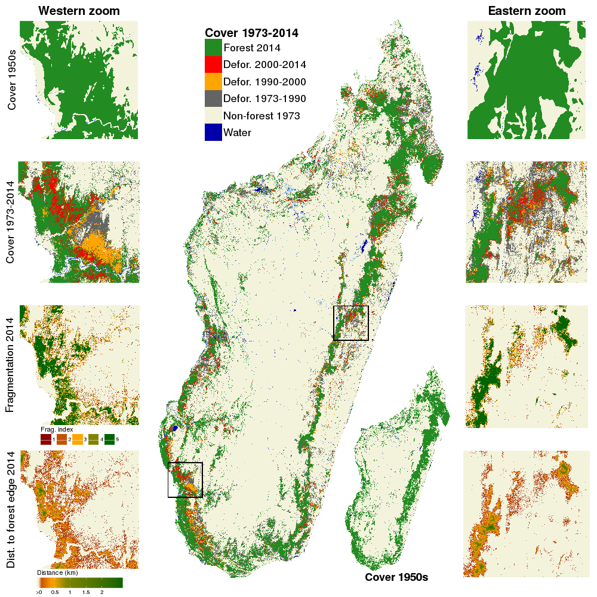

# deforestation-maps-Mada

This repository includes the R/GRASS script and data used to derive the results of the following article:

**Vieilledent G., C. Grinand, F. A. Rakotomalala, R. Ranaivosoa, J.-R. Rakotoarijaona, T. F. Allnutt, and F. Achard.** 2018. Combining global tree cover loss data with historical national forest-cover maps to look at six decades of deforestation and forest fragmentation in Madagascar. _Biological Conservation_. **222**: 189-197.
\[doi:[10.1016/j.biocon.2018.04.008](https://doi.org/10.1016/j.biocon.2018.04.008)\].
[bioRxiv: 147827](https://doi.org/10.1101/147827).

/
Supplementary materials 

## Reproducibility of the results

The results of the study are fully reproducible running the R/GRASS script `deforestmap.R`. Data used for the analysis can be downloaded from the Cirad Dataverse repository: \[DOI: [10.18167/DVN1/2FP7LR](http://dx.doi.org/10.18167/DVN1/2FP7LR)\].

## Main outputs: forest cover and forest fragmentation maps

Main outputs of the study, including Madagascar forest cover maps and forest fragmentation maps for the years 1953, 1973, 1990, 2000, 2005, 2010 and 2014 are available on the Cirad Dataverse repository: \[DOI: [10.18167/DVN1/AUBRRC](http://dx.doi.org/10.18167/DVN1/AUBRRC)\].

## File and folder description

- `data`: folder including two tables with forest-cover and deforestation data from previous studies.
- `manuscript`: folder including all the files (in particular the `.Rnw` file) used to produce the manuscript.
    - `manuscript/bib`: folder including bibliographic files (references and style).
    - `manuscript/figs`: folder including figures used in the manuscript.
    - `manuscript/tabs`: folder including tables used in the manuscript.
- `outputs`: folder including outputs from the R script.
- `R`: folder including an R script to plot the forest cover change figure.

## Dependencies

### Geospatial libraries

Computations detailed in the R script depend on several geospatial libraries external to R. The GDAL library (<http://www.gdal.org/>) and GRASS GIS 7.2.x software (<https://grass.osgeo.org/>) need to be installed to run the R script. Call to GDAL and GRASS GIS 7.2 functions are made through the function `system()` in R. 

### Fragmentation

For computing Riitters et al. 2000 fragmentation index, the `r.forestfrag` add-on must be installed. GRASS GIS add-ons can be easily installed in the local installation through the graphical user interface (Menu - Settings - Addons Extension - Install) or via the [`g.extension`](https://grass.osgeo.org/grass72/manuals/g.extension.html) command.

## Portability

For our study, computations have been done on a Linux workstation. To use the R script, Windows users should preferentially install [OSGeo-Live](https://live.osgeo.org/en/), a geospatial Linux distribution, within a [VirtualBox virtual machine](https://live.osgeo.org/en/quickstart/virtualization_quickstart.html).

Another possibility would be to install [OSGeo4W](https://trac.osgeo.org/osgeo4w/), a binary distribution of a broad set of open source geospatial software for Windows environments including GDAL and GRASS. The script has not been tested on Windows but minimal changes to the code should be necessary to make it work. For example, command `system()` must be replaced by command `shell()` under Windows.

The path to the GRASS GIS package must be provided when connecting R to GRASS with function `initGRASS()`. On Linux, find the path to GRASS GIS with `$ grass72 --config path`. It should return something like `/usr/lib/grass72`. On Windows, find the path to GRASS GIS with `C:\>grass72.bat --config path`. If you use OSGeo4W, it should be `C:\OSGeo4W\apps\grass\grass-7.2`.

## References

Previous reports on deforestation in Madagascar might not be accessible on the long term at their original web address. These reports have been archived on a private Google Drive repository [here](https://drive.google.com/drive/folders/1nq8CuMacT0uZuNO6q05al94d6KYp1FaK?usp=sharing). In particular, the following reports have been made available:

- MEFT, USAID, and CI. (2009). Evolution de la couverture de forêts naturelles à Madagascar, 1990-2000-2005. Antananarivo.
- ONE, DGF, FTM, MNP, and CI. (2013). Evolution de la couverture de forêts naturelles à Madagascar 2005-2010. Antananarivo. [original url](https://www.pnae.mg/couverture-de-forets-naturelles-2005-2010).
- ONE, DGF, MNP, WCS, and Etc Terra. (2015). Changement de la couverture de forêts naturelles à Madagascar, 2005-2010-2013. Antananarivo. [original url](https://www.pnae.mg/couverture-de-forets-naturelles-2005-2010-2013).

## Versioning and archiving on Cirad Dataverse

The development version of this repository is available on GitHub at <https://github.com/ghislainv/deforestation-maps-Mada>. Last version of this repository is archived on Cirad Dataverse: \[DOI: [10.18167/DVN1/275TDF](http://dx.doi.org/10.18167/DVN1/275TDF)\].

## Figure

Figure 2. **Forest-cover change on six decades from 1953 to 2014 in Madagascar.** Forest cover changes from _c._ 1973 to 2014 are shown in the main figure, and forest cover in _c._ 1953 is shown in the bottom-right inset. Two zooms in the western dry (left part) and eastern moist (right part) ecoregions present more detailed views of (from top to bottom): forest-cover in 1950s, forest-cover change from _c._ 1973 to 2014, forest fragmentation in 2014 and distance to forest edge in 2014. Data on water bodies (blue) and water seasonality (light blue for seasonal water to dark blue for permanent water) has been extracted from Pekel et al. (2016).

