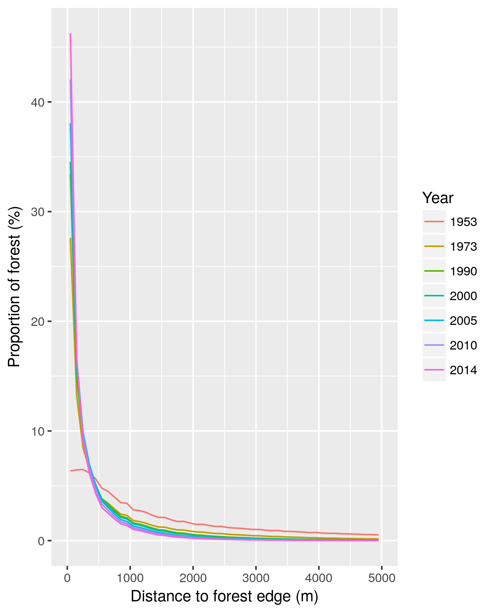

Dr. Ghislain Vieilledent 

CIRAD    
UPR Forêts et Sociétés    
F34398 Montpellier    
FRANCE

Joint Research Center of the European Commission   
Bioeconomy Unit (JRC.D.1)  
I21027 Ispra (VA)  
ITALY

to

Editors    
_Biological Conservation_ 

####

Object: Resubmission of article with Ref: BIOC_2017_861

####

Dear Editor,

Some months ago, we submitted our article untitled "Combining global tree cover loss data with historical national forest-cover maps to look at six decades of deforestation and forest fragmentation in Madagascar" to _Biological Conservation_. Despite relatively positive comments, especially from Reviewer 3, our article was rejected due to methodological issues, raised in particular by Reviewer 1.

We thank the two reviewers for the attention they gave to the first version of the manuscript and their constructive remarks. After careful consideration of the remarks from the two reviewers, we decided to resolve the methodological issues and resubmit our paper to your journal. Detailed answers to remarks and modifications done to the manuscript can be found below.

The new version of the manuscript includes the following main changes:

- We better explain how historical deforestation maps and tree cover datasets have been combined, in particular specifying the interpolation method used for resampling.
- After discussion with Peter Vogt, we modified the way forest fragmentation is computed. We now consider the forest percentage in the neighborhood as an estimate of forest fragmentation.
- We argue better why we decided to look specifically at the amount of forest located at less than 100 m from forest edge.
- We discuss better the validity of our results including validation data for Harper and Hansen products from previous studies.
- Tables have been reformatted to increase readability. Areas are now given in thousands of hectares and deforestation rates are given in %/yr with one decimal precision.
- All the data and the script used for this study have been made permanently and publicly available on the Zenodo research data repository.
- We updated the GitHub repository, providing more information about which external libraries to install and how to run the code on Windows machines.

We made our best to improve the quality of the manuscript following Reviewers' comments and we really hope that you will accept to reconsider our article for publication in your journal.

Best regards,

The authors

# Comments from the Editor

**Dear Dr. Vieilledent,**

**Thank you for submitting your manuscript to Biological Conservation. I regret to inform you that reviewers have advised against publishing your manuscript, and we must therefore reject it. Reviewer 1 in particular is an expert on this topic, and feels that you need to use better methods for your work. If you follow the suggestions of this reviewer, perhaps you will have a much better paper.** 

**Please refer to the comments listed at the end of this letter for details of why I reached this decision.**

**We appreciate your submitting your manuscript to this journal and for giving us the opportunity to consider your work.**

**Kind regards,**

**Richard Primack**  
**Editor-in-Chief**  
**Biological Conservation**

# Answers to remarks by Reviewer 1

**1. Why is "(ONE, DGF, MNP, WCS, and Etc Terra, 2015)" not cited as "ONE et al 2015", and why does the reference not give any information about who or what ONE is, or where to obtain this document.**

Sorry for the incorrect bibliographic format and for not having provided a link to this report. The citation format has been modified and an URL is now given in the bibliography section. Because the URL pointing to this report might not persist in the future, we also archived a `.pdf` of the report on a private Google Drive repository [here](https://drive.google.com/drive/folders/1nq8CuMacT0uZuNO6q05al94d6KYp1FaK?usp=sharing). We did the same for the MEFT et al. 2009 and the ONE et al. 2013 reports. This is now specified in the README file of the GitHub repository associated to this work (<https://github.com/ghislainv/deforestation-maps-Mada>).

**2. The information in Figure 1 can be put in Figure 2. The three major ecoregion boundary lines can be drawn on Fig 2, and the mangrove region can be described as small west coast areas that are too small to render (They are too small to render on Figure 1 also).  The "remaining natural forest" (Fig 1) corresponds to the dark green regions (Fig 2), or can be seen by comparing the inset forest map from 1950's.** 

Given the large amount of information already present on Figure 2, we prefered not to put the information given by Figure 1 in Figure 2. We think this would decrease the readability of Figure 2.

**Related point is why have four "forest types" that are defined as four "ecoregions" - why not forest types or ecoregions but not both, if they are the same?**

We agree with the Reviewer 1 that the two terms can be confusing. The aim of Figure 1 is precisely to explain the differences between ecoregions and forest types. As underlined in the methodology, ecoregions were defined on the basis of climatic and vegetation criteria using the climate classification by [@Cornet1974] and the vegetation classification from the 1996 IEFN national forest inventory [@IEFN1996]. Forest types are defined on the basis of their appartenance to one of the four ecoregions. We modified the legend of Figure 1 to be clearer.

**3. The creation of forest maps for 1953-2014 is probably one of several approaches, but one must do something in order to create the maps and I will leave it to the remote sensing experts to comment on the validity of this particular approach.**

The aim of our article is to present an original methodology combining historical forest cover maps and global tree cover loss data in order to obtain more recent forest cover change maps. This approaches overcomes the problem associated to forest definition in the tree cover products [@Tropek2014]. The originality and robustness of the approach has been recognized by Reviewer 3 in its first comment: "The paper proposes an integrated approach to use existing datasets (national maps + global tree cover change) and produce robust forest change maps".    

**4. Having said that, one of the assumptions of any change analysis (forest area or fragmentation) is that the maps are strictly comparable over time. Apart from the comparability of the definition of forest, there is the comparability of the resolution at which forest is mapped. If I understand this section, the procedure yielded 30-m resolution maps of forest prior to Hansen's 2000 data. That must be true because the forest fragmentation analysis is apparently done at 30-m resolution since 1953. My comments are (1) the authors should clarify and justify their method to produce 30m resolution maps prior to 2000**

We modified the text in the Methods section to describe better how we obained 30 m resolution maps for years 1953 and 1973.  

**(2) explain why they did not use the accepted-usual-commonsense approach of degrading the resolution of Hansen's data to match the earlier maps. The normal procedure when dealing with maps (or any other data type) of different resolution is to use the least precise rather than the most precise resolution as the "target" resolution. Why is it OK to compare Hansen's maps to constructed earlier maps which contain invented data? It seems to me that the signal of forest loss in Madagascar is so large that an analysis using coarser resolution data is going to tell the same story of forest loss and fragmentation, and will also be defensible.**

We understand the concern of Reviewer 1 regarding the resolution at which deforestation and forest fragmentation have been computed. As specified in the paper (in introduction and method), all forest maps from 1990 (1990, 2000, 2005, 2010, 2013 and 2014) have an original resolution of 30 m. They have been derived from the analysis of Landsat 5 TM (Thematic Mapper) and Landsat 5 ETM+ (Enhances Thematic Mapper Plus) satellite images at 28.5 m resolution. On the contrary, the 1973 forest cover map has an original 60 m resolution, as it was derived from Landsat 1 MSS (Multispectral Scanner) satellite images at 57 m resolution [@Harper2007]. The 1953 forest cover map is a vector map obtained from digitalizing aerial photographies. We could have resampled all maps at the coarser resolution, i.e. 60 m, the resolution of the original 1973 map. Computations, especially for the fragmentation, would have been faster and, as underline by Reviewer 1, the _"story about forest loss and fragmentation would have been the same"_. But given the fact that the majority of the maps were at 30 m, and in oder not to loose information, we decided to keep the resolution of 30 m for our deforestation and fragmentation analysis. Deforestation in Madagascar is often associated to small scale slash-and-burn agriculture and a high resolution is required to accurately estimate deforestation [@Grinand2013; @Tyukavina2015].

**5. The fragmentation analysis used the Riitters' 2000 model with a 7x7 window, and a separate distance-to-edge (proximity) metric.  A few comments on that:**

**51. Why 7x7? Did the authors note the imprecision of the method with relatively small windows (e.g., the default r.forestfrag 3x3). The choice of window size depends more on how many pixels in a window rather than the actual area in the window, so how does the 7x7 choice relate to choices by earlier authors, many of whom considered a range of window sizes? The 7x7 is probably OK, but the authors should at least say why 7x7, and/or explain how a different choice of measurement scale does or does not change the results of a scale-dependent measurement such as this.**

**52. Why Riitters 2000 when Peter Vogt has a much better method to derive the classes "perforated" "edge" "patch"?**

**53. The author's "proximity" analysis yields an estimate of Riitters' "interior" for many possible window sizes (because of the relationship between maximum size of a window that can be "interior", and the minimum distance to edge).**

**54. The relationship between edge proximity and Riitters' "interior" raises the question "why do both" particularly since the "interior" analysis corresponds to around 90 meters and the proximity analysis reports 100 meters as the summary number in the discussion. Without doing the proximity analysis, an inference from the "interior" analysis would provide the single summary statistic (% beyond 100m) that is mentioned in the discussion.**

_Grouped answer on points 5, 5.1, 5.2, 5.3, 5.4 and 5.5:_ We have changed the methodology used to estimate forest fragmentation. Following the advice by Reviewer 1, we looked at the approaches developped by Vogt et al. to estimate forest fragmentation. We agree that the method we used, described by Riitters et al. 2000 in _Conservation Ecology_ [@Riitters2000], might have some limitations. This has been demonstrated in @Vogt2007. We have directly contacted Peter Vogt to discuss with him about what would be the best approach to estimate forest fragmentation in our case. We finally decided to compute the percentage of forest in the neighborhood of each forest pixel. To do so, we chose a moving window of 51 by 51 cell size. We explained this choice explicitly in the Methods section of the article. The computation of the forest percentage locally has two main advantages. First, it produces raster maps of forest fragmentation with a continuous forest fragmentation index in the interval ]0, 100]. Then, to synthetize information, the forest fragmentation index can be categorized using classes of forest fragmentation (0-20, 21-40, 41-60, 61-80, 81-100). Second, this approach is not redundant with the proximity analysis we have also performed in the study. The fragmentation index gives the percentage of forest cover locally while the proximity analysis gives the distance of the forest pixel to the forest edge. 

Computational tools have been made available in the Guidos Toolbox software developped by Vogt et al. to estimate the forest fragmentation following this approach. In our case, to keep using the same geospatial softwares that in the rest of the study, we made the computations using function `r.neighbors` from the GRASS GIS software.

**55. The proximity analysis is relatively simple, and I wonder if there is a way to convey more information than decrease in mean distance to edge over time, which is an obvious result of losing half the forest area. Would this work: Look instead at "how much forest is how far from edge" such that the y-axis is forest amount, the x-axis is distance from nearest edge, and a series of curves display the results for years 1953, 1970, etc.  In addition, if the focus is on pattern rather than amount of forest, the y-axis could be standardized as "% of extant forest" so that differences between the curves are easier to interpret as change in pattern (instead of change in amount). In any case, it's not clear that the quantiles shown in Figure 3 are meaningful; of course the range of distance to edge decreases as the mean distance to edge decreases.**

There are several ways to provides information on "how much forest is how far from edge". As suggested by Reviewer 1, we plotted the full distribution of forest pixels as a function of the distance to forest edge using bins of 100 m on a range of distance going from 0 to 5 km (Fig. 1). As expected, when considering each year independently, the proportion of forest decreases with the distance to forest edge. When comparing distributions between years, we observe that a higher proportion of forest is getting closer to forest edge with time. We found that this new figure was not providing more information and was less readable than the figure presented in the first version of the manuscript. We thus decided to keep the original figure with some minor modifications. 

**6 Finally, except for two sentences at line 335 which cite the distance result for 100m, the discussion ignores the fragmentation results. With a richer presentation of the results of the proximity analysis (see above), it may be possible to find some interesting things to discuss about the changes in forest patterns as measured by distance to edge (maybe). Anyway, why do another fragmentation analysis (Riitters' method) if the results are not interpreted or discussed? As it stands now, Table 4 can be deleted with no particular impact on the discussion or interpretation. On the other hand, it could be valuable to leave it in, since the readers of this journal would be especially interested in how, for example, the fragmentation analysis (either one) could "help implement new conservation strategies to save Madagascar natural tropical forests and their unique biodiversity" (final sentence of manuscript).**

The aim of our fragmentation analysis was to show that, in parrallel with deforestation, forest fragmentation was increasing with time. This was shown through results presented in Table 4. In the introduction, we specified why forest fragmentation is a problem for biodiversity conservation:

"Forest fragmentation can also lead to species extinction by isolating populations from each other and creating forest patches too small to maintain viable populations [@Saunders1991]. Fragmentation also increases forest edge where ecological conditions (such as air temperature, light intensity and air moisture) can be dramatically modified, with consequences on the abundance and distribution of species [@Murcia1995]. Forest fragmentation can also have substantial effects on forest carbon
storage capacity, as carbon stocks are much lower at the forest edge than under a closed canopy [@Brinck2017]."

Then, the aim of the proximity analysis was to show that the amount of forest located near the forest edge was progressively increasing. This was shown by Fig. 3 of the article. We also computed the proportion of forest that was located at a distance lower than 100 m from the forest edge for each year. We explained this choice in the Methods section:

"Previous studies have shown that forest micro-habitats were mainly altered within the first 100 m of the forest edge [@Brinck2017; @Gibson2013; @Murcia1995; @Broadbent2008]."

In the discussion part, we underlined that remaining forest is highly fragmented and that a large proportion of the remaining forest (46%) is located at a distance inferior to 100 m from the forest edge:

"Associated to deforestation, we showed that the remaining forests of Madagascar are highly fragmented with 46% of the forest being at less than 100~m of the forest
edge. Small forest fragments do not allow to maintain viable populations and ``edge effects'' at forest/non-forest interfaces have impacts on both carbon emissions [@Brinck2017] and biodiversity loss [@Gibson2013; @Murcia1995]."

In our article, we first show that forest cover has dramatically decreased since 1953 and that the deforestation trend is not decelerating. Second, we show that the remaining forest is highly fragmented and mainly located close to the forest edge. To our point of view, there is nothing else important to say about the fragmentation results in the context of our study. Making these observations is already very important for conservation in Madagascar. In the last section of the discussion part, we discuss the impact of our results on conservation strategies in Madagascar. We underline the fact that past conservation strategies have failed at conserving forests in Madagascar and that more is to be done in order to save Madagascar tropical forests and associated biodiversity. The forest cover and forest fragmentation maps we provide could help implement more efficient conservation strategies. Maps can help identify hotspots of deforestation and search for the underlying causes of deforestation locally. They can also help select areas for conservation or restoration in the framework of REDD+ and optimize the current protected area network.

# Answers to remarks by Reviewer 3

**The paper proposes an integrated approach to use existing datasets (national maps + global tree cover change) and produce robust forest change maps. The methods and tools used are free and open source and made public, which encourages replication and facilitates data sharing. More studies should follow the same example and the initiative is highly appreciated.**

We thank Reviewer 3 for his positive feedbacks.

**However, more attention should be paid on the github repository regarding configuration and required libraries.**

We have enterily rewritten the README page of the GitHub repository. We now specify the external libraries necessary to run the script (GDAL and GRASS GIS 7.2). We also explain how to run the script on Windows machines through the installation of OSGeo-Live or OSGeo4W. 

**The method is applied to Madagascar to produce long term estimation of forest cover change, and thus produces original data.**

**Even though the tools are made public, more descriptions of the methodology regarding maps combination are needed in the body of the paper for ease of understanding of the public.**

We now decribed better the methodology used to combined the Harper's map and the Hansen's tree cover products. In particular, we specified which interpolation method was used to resample Hansen's maps (section 2.1):

"To provide a label (forest or non-forest) to these unclassified pixels, we used the 2000 tree cover percentage map of [@Hansen2013] by selecting a threshold of 75% tree cover to define forest cover as recommended by other studies for the moist domain [@Achard2014; @Aleman2017]. To do so, the Hansen's 2000
tree cover map was resampled on the same grid as the original Harper's map at 30 m resolution using a bilinear interpolation. We thus obtained a forest cover map for the year 2000 covering the full territory of Madagascar. We then combined this forest cover map of the year 2000 with the annual tree cover loss maps from 2001 to 2014 provided by [@Hansen2013] to create annual forest cover maps from 2001 to 2014 at 30 m resolution. To do so, Hansen's tree cover loss maps were resampled on the same grid as the original Harper's map at 30 m resolution using a nearest-neighbor interpolation."

**The method could be improved by allowing more tailored selection of TC thresholds.**

We agree with Reviewer 3 that the method could be improved with a tailored selection of the tree cover threshold. Nonetheless, in our case, the tree cover threshold of 75% is used only to remove clouds over the moist forest in the 2000 Harper's map. In our study, we selected a threshold of 75% tree cover to define the moist forest on the basis of two references [@Achard2014; @Aleman2017]. Choosing another threshold, which would be close to this value of 75% and would affect a limited area, would marginally impact our results.  

**More importantly, no accuracy assessment was done on the resulting maps although suitable data is probably available in the country to do so. The lack of AA is not even discussed in the conclusion.**

A whole paragraph (section 4.1, lines 293-319) now discuss the accuracy of our results. In particular, we recognize that a proper accuracy assessment of our forest cover change maps should be performed to better estimate the uncertainty surrounding our forest cover change estimates in Madagascar from year 2000 [@Olofsson2013; @Olofsson2014]. Collecting enough suitable data, using for example the results of the photo-interpretation of very high resolution satellite images as ground "truth", would require a large amout of additional work and is out of scope of our study. In place, we decided to report the results of previous studies regarding the accuracy of Hansen's tree cover loss data in Sub-Saharian Africa [@Verhegghen2016; @Tyukavina2015]. In particular, we report the large amount of false-negatives (non-detected deforestation) in the tree cover loss product and discuss this limitation:

"In another study assessing the accuracy of the tree cover loss product accross the tropics [@Tyukavina2015], authors reported 4% of false positives and 48% of false negatives in Sub-Saharian Africa. They showed that 85% of missing loss occured on the edges of other loss patches. This means that tree cover loss might be underestimated in Sub-Saharian Africa, probably due to the prevalence of small-scale disturbance which is hard to map at 30 m, but that areas of large-scale deforestation are well identified and spatial variability of the deforestation is well represented."

**Despite those two main drawbacks that need to be corrected, this paper is of good quality and is recommended for publications with revisions.**

We thank Reviewer 3 for his supportive comments.

**Specific comments are given below**

**L23: REDD+ is not an initiative. use "the REDD+ framework" instead (as in L356). If you want to explain acronym, use full description "Reducing emissions from deforestation and forest degradation and the role of conservation, sustainable management of forests and enhancement of forest carbon stocks in developing countries"**

We have replaced "initiative"" by "framework". The full description being too long, we used a commonly accepted description to explain REDD+ acronym: "Reducing Emissions from Deforestation and forest Degradation".

**L94: replace "forest loss" by "tree cover loss". it is well explained elsewhere in the paper, stay consistent (with e.g. L105)**

Thanks for pointing this mistake. In the new version of the manuscript, we only use the term tree cover loss for Hansen's data.

**L106: TC loss is not defined in Hansen 2013 by a 10% threshold. I suggest to delete 104-106, information already presented earlier in the paper.**

We have deleted the sentence.

**L117-118: The approach can be easily repeated with any similar tree cover loss product, I suggest to open the potential of the method rather than limiting it to further updates of GFC, that have proven to be delayed for the past 2 years.**

We have modified the abstract. We now underline this point in the first section of the Discussion part:

"Moreover, this approach could be repeated in the future with the release of updated tree cover loss data."

**L123: please provide minimal information on what you mean by "combining". It is never mentioned in what format (vector? raster?)  and at what resolution the 1953, 1973, 1990 and 2000 Harper maps are. Mention how the products were resampled / aligned, if at all. You mention that you used the TC2000 dataset to fill in the unclassified areas of Harper, but it is not clear if you used the 2000 Harper map as a mask for the subsequent calculation of yearly forest maps.**

The format and resolution of the original maps are specified in the Introduction:

**What happened to the area that are indicated as forest in the Harper_2000 map and that don't match with your 75% threshold in GFC. Are they simply masked out? One of your conclusion is that the method can be replicated easily, please provide minimal supportive description for that.**

We used the 75% tree cover threshold only to remove clouds in Harper's 2000 map (see first section fo the Methods part):

"The 2000 Harper's forest map includes 208,000 ha of unclassified areas due to the presence of clouds on satellite images, mostly (88%) within the moist forest domain which covered 4.17 Mha in total in 2000. To provide a label (forest or non-forest) to these unclassified pixels, we used the 2000 tree cover percentage map of @Hansen2013 by selecting a threshold of 75% tree cover to define forest cover as recommended by other studies for the moist domain [@Achard2014; @Aleman2017]. To do so, the Hansen's 2000 tree cover map was resampled on the same grid as the original Harper's map at 30~m resolution using a bilinear interpolation. We thus obtained a forest cover map for the year 2000 covering the full territory of Madagascar."

**L124: TC loss**

Corrected.

**L130: rather than using a generic threshold of 75%, you could have identified the TC threshold for which are from the TC map of GFC matches the area estimate from the 2000 Harper map. It would have also given you an idea of classification mismatches between both products. Did you consider that approach ? It could make your method more generic and appropriate, in particular in places where forests are more open and less tropical. Please indicate what the "matching" TC threshold is and discuss if very different from 75%.**

See previous answer on "tailored selection of TC thresholds".

**L132/134: how did you deal with pixels of simultaneous gain and loss in the GFC product ? if you did not consider them, please mention it.**

We agree with Reviewer 3 that tree cover gain is an important point. This point is discussed in the first section of the Discussion part:

"Consistent with @Harper2007, we did not consider potential forest regrowth in Madagascar (although @Hansen2013 provided a tree cover gains layer for the period 2001-2013) for several reasons. First, the tree gain layer of @Hansen2013 includes and catches more easily tree plantations than natural forest regrowth
[@Tropek2014]. Second, there is little evidence of natural forest regeneration in Madagascar [@Grouzis2001; @Harper2007]. This can be explained by several ecological processes following burning practice such as soil erosion [@Grinand2017] and reduced seed bank due to fire and soil loss [@Grouzis2001]. Moreover, in areas where forest regeneration is ecologically possible, young forest regrowth are more easily re-burnt for agriculture and pasture. Third, young secondary forests provide more limited ecosystem services compared to old-growth natural forests in terms of biodiversity and carbon storage."

**L136/137: give more details about how that assumption can be considered valid, in particular if plantations potentially occur in the concerned area. Be consistent with L302.**

We gave more details in the text about how the assumption can be considered valid:

"To do so, we assumed that if forest was present in 2000, the pixel was also forested in 1990. Indeed, there is little evidence of natural forest regeneration in Madagascar [@Grouzis2001; @Harper2007], especially over such a short period of time."

Note that in our study, we are only focused on natural forest (not plantations) and we do not consider the tree cover gain. We are thus consistent with the fact that tree gain layer of @Hansen2013 includes and catches more easily tree plantations than natural forest regrowth [@Tropek2014].

**L142: it is not clear how you treated the missing information from the 3.32 million ha of unclassified pixels from 1973 map**

We specified this in the Methods section: "Contrary to the year 1990, the remaining unclassified pixels for year 1973 corresponded to a significant total area of 3.3
million ha which was left as is." See also Tab. 1. numbers and legend.

**L147/152: provide the area figure corresponding to those replaced pixels, that could in other context provide an interesting figure for small scale disturbances.**

**L155: reorder years, 2005 and 2010 inverted**

Done

**L160: no need to precise that t1-t2 is the time between  t1 and t2**

Following the definition of the annual deforestation rate [@Puyravaud2003], it is important to specify the unit: "$t_2-t_1$ is the time-interval (in
years) between the two dates".

**L164: not clear why you change the formula for deforestation rate. please explain or modify, stay consistent.**

This is a misunderstanding, we didn't changed the formula to compute the deforestation rate. We reformulated to be clearer:

"Because of the large unclassified area (3.3 million ha) in 1973, the annual deforestation areas and rates for the two periods 1953-1973 and 1973-1990 are only partial estimates computed on the basis of the available forest extent."

**L218: delete "software" or replace by "library"**

Done

**L283-290: see comments regarding L130**

See previous answer on "tailored selection of TC thresholds".

**L293: many publications have shown lower accuracies of the GFC loss products, give a better understanding of reported accuracies in the literature.**

As said previously, a whole paragraph (section 4.1, lines 293-319) now discuss the accuracy of our results. In particular, we recognize that a proper accuracy assessment of our forest cover change maps should be performed to better estimate the uncertainty surrounding our forest cover change estimates in Madagascar from year 2000 [@Olofsson2013; @Olofsson2014]. Collecting enough suitable data, using for example the results of the photo-interpretation of very high resolution satellite images as ground "truth", would require a large amout of additional work and is out of scope of our study. In place, we decided to report the results of previous studies regarding the accuracy of Hansen's tree cover loss data in Sub-Saharian Africa [@Verhegghen2016; @Tyukavina2015]. In particular, we report the large amount of false-negatives (non-detected deforestation) in the tree cover loss product and discuss this limitation:

"In another study assessing the accuracy of the tree cover loss product accross the tropics [@Tyukavina2015], authors reported 4% of false positives and 48% of false negatives in Sub-Saharian Africa. They showed that 85% of missing loss occured on the edges of other loss patches. This means that tree cover loss might be underestimated in Sub-Saharian Africa, probably due to the prevalence of small-scale disturbance which is hard to map at 30 m, but that areas of large-scale deforestation are well identified and spatial variability of the deforestation is well represented."

**L297: provide corresponding accuracies. we stay with the impression that GFC is 99.6% accurate for loss, this is misleading**

See previous answer.

**L342/345: you have not provided any accuracy assessment of the change in that study and there is no evidence that the change in trends you show are statistically significant. This is a real limitation of the paper and you should discuss on this. At the very least, include a remark in your conclusion that these results need to be confirmed through a proper accuracy assessment as recommended in the appropriate literature (e.g Olofsson et al 2013/2014)**

See previous answer.

**L354: delete project**

Done.

**L385: please indicate under which environment the processing was done (.sh scripts suggest Linux distribution), give versions of the tools and libraries and increase readability of the github repository. The README file requires serious edition and general guidelines on how to perform the processing. Indicate under which OS the process could be reproduced and what challenges/opportunities are related to the migration of the given scripts if the methodology was applied only under Linux OS**

As said previously, we have enterily rewritten the README page of the GitHub repository. We now specify the external libraries necessary to run the script (GDAL and GRASS GIS 7.2). We also explain how to run the script on Windows machines through the installation of OSGeo-Live or OSGeo4W. 

**Table 1: for 1953 and 1973 deforestation rates are computed based on the available forest extent. indicative is not the right word, use partial instead. Replace "the two last" by "the last two".**

We made the suggested corrections.

# References