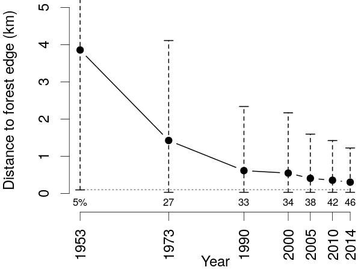

```{r options, echo=FALSE, results="hide"}
library(bookdown)
library(knitr)
library(kableExtra)
opts_chunk$set(echo=FALSE, cache=FALSE,
               #results="hide", 
               warning=FALSE,
               message=FALSE, highlight=TRUE,
               fig.show="hide", size="small",
               fig.align="center",
               tidy=FALSE)
options(knitr.kable.NA="-")
```

**Ghislain Vieilledent$^{1,2,\star}$, Clovis Grinand$^{3}$, Fety A. Rakotomalala$^{3}$, Rija Ranaivosoa$^{4}$, Jean-Roger Rakotoarijaona$^{4}$, Thomas F. Allnutt$^{5,6}$, and Frédéric Achard$^{1}$**

1. Joint Research Center of the European Commission, Bio-economy Unit (JRC.D.1), I-21027 Ispra (VA), ITALY
2. Cirad, UPR Forêts et Sociétés, F-34398 Montpellier, FRANCE
3. ETC Terra, F-75016 Paris, FRANCE
4. Office National pour l'Environnement, 101 Antananarivo, MADAGASCAR
5. Wildlife Conservation Society, 101 Antananarivo, MADAGASCAR
6. GreenInfo Network, Oakland, California, USA

**Abstract**: The island of Madagascar has a unique biodiversity, mainly located in the tropical forests of the island. This biodiversity is highly threatened by anthropogenic deforestation. Existing historical forest maps at national level are scattered and have substantial gaps which prevent an exhaustive assessment of long-term deforestation trends in Madagascar. In this study, we combine historical national forest cover maps (covering the period 1953-2000) with a recent global annual tree cover loss dataset (2001-2014) to look at six decades of deforestation and forest fragmentation in Madagascar (from 1953 to 2014). We produced new forest cover maps at 30 m resolution for the year 1990 and annually from 2000 to 2014 over the full territory of Madagascar. We estimated that Madagascar has lost 44% of its natural forest cover over the period 1953-2014 (including 37% over the period 1973-2014). Natural forests cover 8.9 Mha in 2014 (15% of the national territory) and include 4.4 Mha (50%) of moist forests, 2.6 Mha (29%) of dry forests, 1.7 Mha of spiny forests (19%) and 177,000 ha (2%) of mangroves. Since 2005, the annual deforestation rate has progressively increased in Madagascar to reach 99,000 ha/yr during 2010-2014 (corresponding to a rate of 1.1%/yr). This increase is probably due to rapid population growth (close to 3%/yr) and to poor law enforcement in the country. Around half of the forest (46%) is now located at less than 100 m from the forest edge. Accurate forest cover change maps can be used to assess the effectiveness of past and current conservation programs and implement new strategies for the future. In particular, forest maps and estimates can be used in the REDD+ framework which aims at "Reducing Emissions from Deforestation and Forest Degradation" and for optimizing the current protected area network.
  
**Keywords**: biodiversity, climate-change, deforestation, forest-fragmentation, Madagascar, tropical forest

**Running headline**: Six decades of deforestation in Madagascar

($\star$) Corresponding author: <ghislain.vieilledent@cirad.fr>

```{r highlights}
# # Highlights
# - We produced new 30m-resolution annual forest-cover maps for Madagascar for the period 2000-2014.
# - Madagascar has lost 44% of its natural forest-cover over the period 1953-2014.
# - Half of the tropical forest in Madagascar is now located at less than 100m from forest edge.
# - Annual deforestation rate has increased in Madagascar since 2005 to reach 1.08%/yr.
# - Conservation and development efforts must be intensified to save Madagascar forest and biodiversity.
```

# Introduction

Separated from the African continent and the Indian plate about 165 and
88 million years ago respectively [@Ali2008], the flora and fauna of
Madagascar followed its own evolutionary path. Isolation combined with a
high number of micro-habitats [@Pearson2009] has led to Madagascar's
exceptional biodiversity both in term of number of species and endemism
in many taxonomic groups [@Crottini2012; @Goodman2005]. Most of the
biodiversity in Madagascar is concentrated in the tropical forests of
the island which can be divided into four types: the moist forest in the
East, the dry forest in the West, the spiny forest in the South and the
mangroves on the West coast [@Vieilledent2016]. This unparalleled
biodiversity is severely threatened by deforestation
[@Harper2007; @Vieilledent2013] associated with human activities such as
slash-and-burn agriculture and pasture [@Scales2011]. Tropical forests
in Madagascar also store a large amount of carbon [@Vieilledent2016] and
high rates of deforestation in Madagascar are responsible for large
CO$_2$ emissions in the atmosphere [@Achard2014]. Deforestation
threatens species survival by directly reducing their available habitat
[@Brooks2002; @Tidd2001]. Forest fragmentation can also lead to species
extinction by isolating populations from each other and creating forest
patches too small to maintain viable populations [@Saunders1991].
Fragmentation also increases forest edge where ecological conditions
(such as air temperature, light intensity and air moisture) can be
dramatically modified, with consequences on the abundance and
distribution of species [@Murcia1995]. Forest fragmentation can also
have substantial effects on forest carbon storage capacity, as carbon
stocks are much lower at the forest edge than under a closed canopy
[@Brinck2017]. Moreover, forest carbon stocks vary spatially due to
climate or soil factors [@Saatchi2011; @Vieilledent2016]. As a
consequence, accurate and spatially explicit maps of forest cover and
forest cover change are necessary to monitor biodiversity loss and
carbon emissions from deforestation and forest fragmentation, assess the
efficiency of present conservation strategies [@Eklund2016], and
implement new strategies for the future
[@Vieilledent2013; @Vieilledent2016]. Simple time-series of forest cover
estimates, such as those provided by the FAO Forest Resource Assessment
report [@Keenan2015] are not sufficient.

Unfortunately, accurate and exhaustive forest cover maps are not
available for Madagascar after year 2000. @Harper2007 produced maps of
forest cover and forest cover changes over Madagascar for the years
_c._ 1953, _c._ 1973, 1990 and 2000. The _c._ 1953 forest map was
derived from the visual interpretation of aerial photography at coarse
scale (1/1,000,000). Forest maps for the years _c._ 1973, 1990, and 2000
were obtained from supervised classification of Landsat satellite images
at 60 m resolution (for the year 1973) or 30 m resolution (for years
1990 and 2000) and can be used to derive more accurate estimates of
forest cover (89.5% accuracy reported for the forest/non-forest map of
year 2000). Nonetheless, maps provided by @Harper2007 are not exhaustive
(due to the presence of clouds in the satellite imagery), e.g. 11
244 km2 are mapped as unknown cover type for the year 2000. Using a
similar supervised classification approach as in @Harper2007, more
recent maps have been produced for the periods 2000-2005-2010 by
national institutions, with the technical support of international
environmental NGOs [@MEFT2009; @ONE2013]. Another set of recent forest
cover maps using an advanced statistical tool for classification, the
Random Forest classifier [@Grinand2013; @Rakotomalala2015], was produced
for the periods 2005-2010-2013 [@ONE2015]. However, these maps are
either too old to give recent estimates of deforestation
[@MEFT2009; @ONE2013], include large areas of missing information due to
images with high percentage of cloud cover [@ONE2013], or show large
mis-classification in specific areas, especially in the dry and spiny
forest domain for which the spectral answer has a strong seasonal
behavior due to the deciduousness of such forests (overall accuracy is
lower than 0.8 for the dry and spiny forests for the maps produced by
@ONE2015). Moreover, the production of such forest maps from a
supervised classification approach requires significant resources,
especially regarding the image selection step (required to minimize
cloud cover) and the training step (visual interpretation of a large
number of polygons needed to train the classification algorithm)
[@Rakotomalala2015]. Most of this work of image selection and visual
interpretation would need to be repeated to produce new forest maps in
the future using a similar approach.

Global forest or tree cover products have also been published recently
and can be tested at the national scale for Madagascar. @Kim2014
produced a global forest cover change map from 1990 to 2000 (derived
from Landsat imagery). This product was updated to cover the period
1975-2005 (<http://glcf.umd.edu/data/landsatFCC/>) but forest cover maps
after 2005 were not produced. Moreover, the approach used in @Kim2014
did not accurately map the forests in the dry and spiny ecosystems of
Madagascar (see Fig. 8 in @Kim2014). @Hansen2013 mapped tree cover
percentage, annual tree cover loss and gain from 2000 to 2012 at global
scale at 30 m resolution. This product has since been updated and is now
available up to the year 2014 [@Hansen2013]. To map forest cover from
the @Hansen2013 product, a tree cover threshold must be selected (that
defines forest cover). Selecting such a threshold is not straightforward
as the accuracy of the global tree cover map strongly varies between
forest types, and is substantially lower for dry forests than for moist
forests [@Bastin2017]. Moreover, the @Hansen2013 product does not
provide information on land-use. In particular the global tree cover map
does not separate tree plantations such as oil palm or eucalyptus
plantations from natural forests [@Tropek2014]. Thus, the global tree
cover map from @Hansen2013 cannot be used alone to produce a map of
forest cover [@Tyukavina2017].

In this study, we present a simple approach which combines the
historical forest maps from @Harper2007 and more recent global products
from @Hansen2013 to derive annual wall-to-wall forest cover change maps
over the period 2000-2014 for Madagascar. We use the forest cover map
provided by @Harper2007 for the year 2000 (defining the land-use) with
the tree cover loss product provided by @Hansen2013 that we apply only
inside forest areas identified by @Harper2007. Similar to the approach
of @Harper2007, we also assess trends in deforestation rates and forest
fragmentation from _c._ 1953 to 2014. We finally discuss the possibility
to extend our approach to other tropical countries or repeat it in the
future. We also discuss how our results could help assess the
effectiveness of current conservation strategies, and implementation new
conservation strategies for the future in Madagascar.

# Materials and Methods

## Creation of new forest cover maps of Madagascar from 1953 to 2014

We produced annual forest/non-forest maps at 30 m resolution for the
full territory of Madagascar for the period 2000-2014 by combining the
forest map of year 2000 from @Harper2007, and the tree cover percentage
and annual tree cover loss maps over the period 2000-2014 from
@Hansen2013. The 2000 Harper's forest map includes 208,000 ha of
unclassified areas due to the presence of clouds on satellite images,
mostly (88%) within the moist forest domain which covered 4.17 Mha in
total in 2000. To provide a label (forest or non-forest) to these
unclassified pixels, we used the 2000 tree cover percentage map of
@Hansen2013 by selecting a threshold of 75% tree cover to define forest
cover as recommended by other studies for the moist domain
[@Achard2014; @Aleman2017]. To do so, the Hansen's 2000 tree cover map
was resampled on the same grid as the original Harper's map at 30 m
resolution using a bilinear interpolation. We thus obtained a forest
cover map for the year 2000 covering the full territory of Madagascar.
We then combined this forest cover map of the year 2000 with the annual
tree cover loss maps from 2001 to 2014 provided by @Hansen2013 to create
annual forest cover maps from 2001 to 2014 at 30 m resolution. To do so,
Hansen's tree cover loss maps were resampled on the same grid as the
original Harper's map at 30 m resolution using a nearest-neighbor
interpolation. We also completed the Harper's forest map of year 1990 by
filling unclassified areas (due to the presence of clouds on satellite
images) using our forest cover map of year 2000. To do so, we assumed
that if forest was present in 2000, the pixel was also forested in 1990.
The remaining unclassified pixels were limited to a relatively small
total area of _c._ 8,000 ha. We labeled these residual pixels as
non-forest, as for the year 2000. Similarly we completed the Harper's
forest map of year 1973 by filling unclassified areas using our forest
cover map of the year 1990 assuming that if forest was present in 1990,
it was also present in 1973. Contrary to the year 1990, the remaining
unclassified pixels for year 1973 corresponded to a significant total
area of 3.3 million ha. We also reprojected the forest cover map of year
1953 to a common projection in order to compare the forest cover area in
1953 with forest cover areas at the following dates. This map was
produced by scanning a paper map derived from aerial photos, and thus
could not be perfectly aligned with the other maps produced through
digital processing of satellite imagery [@Harper2007]. Finally for all
forest cover maps from 1973, the isolated single non-forest pixels
(i.e. fully surrounded by forest pixels) were removed, assuming that
single non-forest pixels inside a forest patch were not corresponding to
deforestation (they might correspond to selective logging activities).
This allowed us to avoid counting very small scale events (\<0.1 ha,
such as selective logging) as forest fragmentation. All the resulting
maps have been made permanently and freely available on the Zenodo
research data repository at <https://doi.org/10.5281/zenodo.1145785>.

## Computing forest cover areas and deforestation rates

From these new forest cover maps, we calculated the total forest cover
area for seven available years (1953-1973-1990-2000-2005-2010-2014), and
the annual deforested area and annual deforestation rate for the
corresponding six time periods between 1953 and 2014. The annual
deforestation rates were calculated using Eq. \@ref(eq:theta) [@Puyravaud2003; @Vieilledent2013]:

\begin{equation}
  (\#eq:theta)
  \theta = 100 \times [1-(1-(F_{t_2}-F_{t_1})/F_{t_1})^{(1/(t_2-t_1))}]
\end{equation}

In Eq. \@ref(eq:theta), $\theta$ is the annual deforestation rate (in
%/yr), $F_{t_2}$ and $F_{t_1}$ are the forest cover free of clouds at
both dates $t_2$ and $t_1$, and $t_2-t_1$ is the time-interval (in
years) between the two dates.

Because of the large unclassified area (3.3 million ha) in 1973, the
annual deforestation areas and rates for the two periods 1953-1973 and
1973-1990 are only partial estimates computed on the basis of the
available forest extent. Area and rate estimates are produced at the
national scale and for the four forest ecosystems present in Madagascar:
moist forest in the East, dry forest in the West, spiny forest in the
South, and mangroves on the Western coast
(Fig. \@ref(fig:ecoregions)). To define the forest domains, we used a map
from the MEFT (*"Ministère de l'Environnement et des Forêts à
Madagascar"*) with the boundaries of the four ecoregions in Madagascar.
Ecoregions were defined on the basis of climatic and vegetation criteria
using the climate classification by @Cornet1974 and the vegetation
classification from the 1996 IEFN national forest inventory [@IEFN1996].
Because mangrove forests are highly dynamic ecosystems that can expand
or contract on decadal scales depending on changes in environmental
factors [@Armitage2015], a fixed delimitation of the mangrove ecoregion
on six decades might not be fully appropriate. As a consequence, our
estimates of the forest cover and deforestation rates for mangroves in
Madagascar must be considered with this limitation.

## Comparing our forest cover and deforestation rate estimates with previous studies

We compared our estimates of forest cover and deforestation rates with
estimates from the three existing studies at the national scale for
Madagascar: (i) @Harper2007, (ii) @MEFT2009 and (iii) @ONE2015.
@Harper2007 provides forest cover and deforestation estimates for the
periods c. 1953-c. 1973-1990-2000. @MEFT2009 provides estimates for the
periods 1990-2000-2005 and @ONE2015 provides estimates for the periods
2005-2010-2013. To compare our forest cover and deforestation estimates
over the same time periods, we consider an additional time-period in our
study (2010-2013) by creating an extra forest cover map for the year
2013. We computed the Pearson's correlation coefficient and the root
mean square error (RMSE) between our forest cover estimates and forest
cover estimates from previous studies for all the dates and forest types
(including also the total forest cover estimates). For previous studies,
the computation of annual deforestation rates (in %/yr) is not always
detailed and might slightly differ from one study to another [see @Puyravaud2003]. @Harper2007 also provide total deforested areas for the
two periods 1973-1990 and 1990-2000. We converted these values into
annual deforested area estimates. When annual deforested areas were not
reported (for 1953-1973 in @Harper2007 and in @MEFT2009 and @ONE2015),
we computed them from the forest cover estimates in each study. These
estimates cannot be corrected from the potential bias due to the
presence of residual clouds. Forest cover and deforestation rates were
then compared between all studies for the whole of Madagascar and the
four ecoregions. The same ecoregion boundaries as in our study were used
in @ONE2015 but this was not the case for @Harper2007 and @MEFT2009,
which can explain a part of the differences between the estimates.

## Fragmentation

We also conducted an analysis of changes in forest fragmentation for the
years 1953, 1973, 1990, 2000, 2005, 2010 and 2014 at 30 m resolution. We
used a moving window of $51 \times 51$ pixels centered on each forest
pixel to compute the percentage of forest pixels in the neighborhood. We
used this percentage as an indication of the forest fragmentation. The
size of the moving windows was based on a compromise: a sufficiently
high number of cells (here 2601) had to be considered to be able to
compute a percentage and a reasonably low number of cells had to be
choosen to have a local estimate of the fragmentation. Computations were
done using the function `r.neighbors` of the GRASS GIS software
[@Neteler2008]. Using the density of forest in the neighborhood, we
defined five forest fragmentation classes: 0-20% (highly fragmented),
21-40%, 41-60%, 61-80% and 81-100% (lowly fragmented). We reported the
percentage of forest falling in each fragmentation class for the six
years and analyzed the dynamics of fragmentation over the six decades.

We also computed the distance to forest edge for all forest pixels for
the years 1953, 1973, 1990, 2000, 2005, 2010 and 2014. For that, we used
the function `gdal_proximity.py` of the GDAL library
(<http://www.gdal.org/>). We computed the mean and 90% quantiles (5% and
95%) of the distance to forest edge and looked at the evolution of these
values with time. Previous studies have shown that forest micro-habitats
were mainly altered within the first 100 m of the forest edge
[@Brinck2017; @Gibson2013; @Murcia1995; @Broadbent2008]. Consequently,
we also estimated the percentage of forest within the first 100 m of the
forest edge for each year and looked at the evolution of this percentage
over the six decades.

# Results

## Forest cover change and deforestation rates

Natural forests in Madagascar covered 16.0 Mha in 1953, about 27% of
the national territory of 587,041 km2. In 2014, the forest cover
dropped to 8.9 Mha, corresponding to about 15% of the national
territory (Fig. \@ref(fig:fcc) and
Tab. \@ref(tab:forestcover)). Madagascar has lost 44% and 37% of its
natural forests between 1953 and 2014, and between 1973 and 2014
respectively (Fig. \@ref(fig:fcc) and Tab. \@ref(tab:forestcover)). In
2014 the remaining 8.9 Mha of natural forest were distributed as
follow: 4.4 Mha of moist forest (50% of total forest cover), 2.6 Mha
of dry forest (29%), 1.7 Mha of spiny forest (19%) and 0.18 Mha
(2%) of mangrove forest (Fig. \@ref(fig:ecoregion) and
Tab. \@ref(tab:compforest)). Regarding the deforestation trend, we
observed a progressive decrease of the deforestation rate after 1990
from 205,000 ha/yr (1.6%/yr) over the period 1973-1990 to 42,000
ha/yr (0.4%/yr) over the period 2000-2005
(Tab. \@ref(tab:forestcover)). Then from 2005, the deforestation rate
has progressively increased and has more than doubled over the period
2010-2014 (99,000 ha/yr, 1.1%/yr) compared to 2000-2005
(Tab. \@ref(tab:forestcover)). The deforestation trend, characterized
by a progressive decrease of the deforestation rate over the period
1990-2005 and a progressive increase of the deforestation after 2005,
is valid for all four forest types except the spiny forest
(Tab. \@ref(tab:compdefor)). For the spiny forest, the deforestation
rate during the period 2010-2013 was lower than on the period
2005-2010 (Tab. \@ref(tab:compdefor)).

## Comparison with previous forest cover change studies in Madagascar

Forest cover maps provided by previous studies over Madagascar were
not exhaustive (unclassified areas) due to the presence of clouds on
satellite images used to produce such maps. In @Harper2007, the
maps of years 1990 and 2000 include 0.5 and 1.12 Mha of unknown cover
type respectively. Proportions of unclassified areas are not reported
in the two other existing studies at the national level by
@MEFT2009 and @ONE2015. With our approach, we produced
wall-to-wall forest cover change maps from 1990 to 2014 for the full
territory of Madagascar (Tab. \@ref(tab:forestcover)). This allowed us
to produce more robust estimates of forest cover and deforestation
rates over this period. Our forest cover estimates over the period
1953-2013 (considering forest cover estimates at national level and by
ecoregions for all the available dates) were well correlated
(Pearson's correlation coefficient = 0.99) to estimates from the
three previous studies (Tab. \@ref(tab:compforest)) with a RMSE of
300,000 ha (6\% of the mean forest cover of 4.8 Mha when considering
all dates and forest types together). These small differences can be
partly attributed to differences in ecoregion boundaries. Despite
significant differences in deforestation estimates
(Tab. \@ref(tab:compdefor)), a similar deforestation trend was
observed across studies with a decrease of deforestation rates over
the period 1990-2005, followed by a progressive increase of the
deforestation after 2005.

## Evolution of forest fragmentation with time

In parallel to the dynamics of deforestation, forest fragmentation has
progressively increased since 1953 in Madagascar. We observed a
continuous decrease of the mean distance to forest edge from 1953 to
2014 in Madagascar. The mean distance to forest edge has decreased to
_c._ 300 m in 2014 while it was previously _c._ 1.5 km in
1973 (Fig. \@ref(fig:distedge)). Moreover, a large proportion (73%)
of the forest was located at a distance greater than 100 m in 1973,
while almost half of the forest (46%) is now at a distance lower than
100~m from forest edge in 2014 (Fig. \@ref(fig:distedge)). The
percentage of lowly fragmented forest in Madagascar has continuously
decreased since 1953. The percentage of forest belonging to the lowly
fragmented category has fallen from 57% in 1973 to 44% in 2014. In
2014, 22% of the forest belonged to the two highest
fragmented forest classes (less than 40% of forest cover in the
neighborhood) while 15% of the forest belonged to these two
classes in 1973 (Tab. \@ref(tab:frag)).

# Discussion

## Advantages of combining recent global annual tree cover loss data with historical national forest cover maps

In this study, we combined recent (2001-2014) global annual tree cover
loss data [@Hansen2013] with historical (1953-2000) national forest
cover maps [@Harper2007] to look at six decades (1953-2014) of
deforestation and forest fragmentation in Madagascar. We produced annual
forest cover maps at 30 m resolution covering Madagascar for the period
2000 to 2014. Our study extends the forest cover monitoring on a six
decades period (from 1953 to 2014) while harmonizing the data from
previous studies [@Harper2007; @MEFT2009; @ONE2015]. We propose a
generic approach to solve the problem of forest definition which is
needed to transform the 2000 global tree cover dataset from @Hansen2013
into a forest/non-forest map [@Tropek2014]. We propose to use a
historical national forest cover map, based on a national forest
definition, as a forest cover mask. This approach could be easily
extended to other regions or countries for which an accurate forest
cover map is available at any date within the period 2000-2014, but
preferably at the beginning of the period to profit from the full record
and derive long-term estimates of deforestation. Moreover, this approach
can be repeated in the future if and when the global tree cover product
is updated. We have made the `R/GRASS` code used for this
study freely available in a GitHub repository (see Data availability
statement) to facilitate application to other study areas or repeat the
analysis in the future for Madagascar.

The accuracy of the derived forest cover change maps depends directly on
the accuracies of the historical forest cover maps and the tree cover
loss dataset. Using visual-interpretation of aerial images in 342 areas
distributed among all forest types, @Harper2007 estimated an overall
89.5% accuracy in identifying forest/non-forest classes for the year
2000. The accuracy assessment of the tree cover loss dataset for the
tropical biome reported 13% of false positives and 16.9% of false
negatives (see Tab. S5 in @Hansen2013). These numbers rise at 20.7% and
20.6% respectively for the subtropical biome. In the subtropical biome,
the lower density tree cover canopy makes it difficult to detect change
from tree cover to bare ground. For six countries in Central Africa,
with a majority of moist dense forest, @Verhegghen2016 have compared
deforestation estimates derived from the global tree cover loss dataset
[@Hansen2013] with results derived from semi-automated supervised
classification of Landsat satellite images [@Achard2014] and they found
a good agreement between the two sets of estimates. Therefore, our
forest cover change maps after 2000 might be more accurate for the dense
moist forest than for the dry and spiny forest. In another study
assessing the accuracy of the tree cover loss product accross the
tropics [@Tyukavina2015], authors reported 4% of false positives and 48%
of false negatives in Sub-Saharian Africa. They showed that 85% of
missing loss occured on the edges of other loss patches. This means that
tree cover loss might be underestimated in Sub-Saharian Africa, probably
due to the prevalence of small-scale disturbance which is hard to map at
30 m, but that areas of large-scale deforestation are well identified
and spatial variability of the deforestation is well represented. A
proper accuracy assessment of our forest cover change maps should be
performed to better estimate the uncertainty surrounding our forest
cover change estimates in Madagascar from year 2000
[@Olofsson2013; @Olofsson2014]. Despite this limitation, we have shown
that the deforestation trend we observed for Madagascar, with a doubling
deforestation on the period 2010-2014 compared to 2000-2005, was
consistent with the other studies at the national scale
[@ONE2015; @MEFT2009].

Consistent with @Harper2007, we did not consider potential forest
regrowth in Madagascar (although @Hansen2013 provided a tree cover gains
layer for the period 2001-2013) for several reasons. First, the tree
gain layer of @Hansen2013 includes and catches more easily tree
plantations than natural forest regrowth [@Tropek2014]. Second, there is
little evidence of natural forest regeneration in Madagascar
[@Grouzis2001; @Harper2007]. This can be explained by several ecological
processes following burning practice such as soil erosion [@Grinand2017]
and reduced seed bank due to fire and soil loss [@Grouzis2001].
Moreover, in areas where forest regeneration is ecologically possible,
young forest regrowth are more easily re-burnt for agriculture and
pasture. Third, young secondary forests provide more limited ecosystem
services compared to old-growth natural forests in terms of biodiversity
and carbon storage.

## Natural forest cover change in Madagascar from 1953 to 2014

We estimated that natural forest in Madagascar covers 8.9 Mha in 2014
(corresponding to 15% of the country) and that Madagascar has lost 44%
of its natural forest since 1953 (37% since 1973). There is ongoing
scientific debate about the extent of the "original" forest cover in
Madagascar, and the extent to which humans have altered the natural
forest landscapes since their large-scale settlement around 800 CE
[@Burns2016; @Cox2012]. Early French naturalists stated that the full
island was originally covered by forest [@Humbert1927; @Perrier1921],
leading to the common statement that 90% of the natural forests have
disappeared since the arrival of humans on the island [@Kull2000]. More
recent studies counter-balanced that point of view saying that extensive
areas of grassland existed in Madagascar long before human arrival and
were determined by climate, natural grazing and other natural factors
[@Vorontsova2017; @Virah-Sawmy2009]. Other authors have questioned the
entire narrative of extensive alteration of the landscape by early human
activity which, through legislation, has severe consequences on local
people [@Klein2002; @Kull2000]. Whatever the original proportion of
natural forests and grasslands in Madagascar, our results demonstrate
that human activities since the 1950s have profoundly impacted the
natural tropical forests and that conservation and development programs
in Madagascar have failed to stop deforestation in the recent years.
Deforestation has strong consequences on biodiversity and carbon
emissions in Madagascar. Around 90% of Madagascar's species are forest
dependent [@Allnutt2008; @Goodman2005] and @Allnutt2008 estimated that
deforestation between 1953 and 2000 led to an extinction of 9% of the
species. The additional deforestation we observed over the period
2000-2014 (around 1Mha of natural forest) worsen this result. Regarding
carbon emissions, using the 2010 aboveground forest carbon map by
@Vieilledent2016, we estimated that deforestation on the period
2010-2014 has led to 40.2 Mt C of carbon emissions in the atmosphere (10
Mt C /yr) and that the remaining aboveground forest carbon stock in 2014
is 832.8 Mt C. Associated to deforestation, we showed that the remaining
forests of Madagascar are highly fragmented with 46% of the forest being
at less than 100 m of the forest edge. Small forest fragments do not
allow to maintain viable populations and "edge effects" at
forest/non-forest interfaces have impacts on both carbon emissions
[@Brinck2017] and biodiversity loss [@Gibson2013; @Murcia1995].

## Deforestation trend and impacts on conservation and development policies

In our study, we have shown that the progressive decrease of the
deforestation rate on the period 1990-2005 was followed by a continuous
increase in the deforestation rate on the period 2005-2014. In
particular, we showed that deforestation rate has more than doubled on
the period 2010-2014 compared to 2000-2005. Our results are confirmed by
previous studies [@Harper2007; @MEFT2009; @ONE2015] despite differences
in the methodologies regarding (i) forest definition (associated to
independent visual interpretations of observation polygons to train the
classifier), (ii) classification algorithms, (iii) deforestation rate
computation method, and (iv) correction for the presence of clouds. Our
deforestation rate estimates from 1990 to 2014 have been computed from
wall-to-wall maps at 30 m resolution and can be considered more accurate
in comparison with estimates from these previous studies. Our forest
cover and deforestation rate estimates can be used as source of
information for the next FAO Forest Resources Assessment [@Keenan2015].
Current rates of deforestation can also be used to build reference
scenarios for deforestation in Madagascar and contribute to the
implementation of deforestation mitigation activities in the framework
of REDD+ [@Olander2008].

The increase of deforestation rates after 2005 can be explained by
population growth and political instability in the country. Nearly 90%
of Madagascar's population relies on biomass for their daily energy
needs [@Minten2013] and the link between population size and
deforestation has previously been demonstrated in Madagascar
[@Vieilledent2013; @Gorenflo2011]. With a mean demographic growth rate
of about 2.8%/yr and a population which has increased from 16 to 24
million people on the period 2000-2015 [@UN2015], the increasing demand
in wood-fuel and space for agriculture is likely to explain the increase
in deforestation rates. The political crisis of 2009 [@Ploch2012],
followed by several years of political instability and weak governance
could also explain the increase in the deforestation rate observed on
the period 2005-2014 [@Smith2003]. These results show that despite the
conservation policy in Madagascar [@Freudenberger2010], deforestation
has dramatically increased at the national level since 2005. Results of
this study, including recent spatially explicit forest cover change maps
and forest cover estimates, should help implement new conservation
strategies to save Madagascar natural tropical forests and their unique
biodiversity.

# Author's contribution

All authors conceived the ideas and designed methodology; GV analysed
the data and wrote the `R/GRASS` script; GV drafted the
manuscript. All authors contributed critically to the drafts and gave
final approval for publication.

# Acknowledgements

The authors thank Jean-François Bastin for useful comments on a previous
version of the manuscript and Peter Vogt for useful advices on which
metric to use to estimate forest fragmentation. This study is part of
the Cirad's BioSceneMada project (<https://bioscenemada.cirad.fr>) and
the Joint Research Center's ReCaREDD project
(<http://forobs.jrc.ec.europa.eu/recaredd>). The BioSceneMada project is
funded by FRB (Fondation pour la Recherche sur la Biodiversité) and the
FFEM (Fond Français pour l'Environnement Mondial) under the project
agreement AAP-SCEN-2013 I. The ReCaREDD project is funded by the
European Commission. The authors declare that there are no conflicts of
interest related to this article.

# Data accessibility

All the data and the script used for this study have been made
permanently and publicly available on the Zenodo research data
repository so that the results are entirely reproducible:

-   Input data: <https://doi.org/10.5281/zenodo.1118955>
-   Script: <https://doi.org/10.5281/zenodo.1118484>
-   Output data: <https://doi.org/10.5281/zenodo.1145785>

# Tables

(ref:tabcap1) **Evolution of natural forest cover and deforestation rates from 1953 to 2014 in Madagascar.** Areas are provided in thousands of hectares (Kha). Forest map for the year 1973 has 3.3 Mha of unclassified areas due to the presence of clouds on satellite images. As a consequence, partial deforestation rates for the periods 1953-1973 and 1973-1990 are computed based on the available forest extent. The last two columns indicate the annual deforested areas and annual deforestation rates on the previous time-period (e.g. 1953-1973 for year 1973, 1973-1990 for year 1990, etc.).

```{r forestcover}
defor.df <- read.table(file="tabs/defor.txt", sep="\t", header=TRUE)
perc.1 <- round(100*(defor.df$area[defor.df$Year==1973]-defor.df$area[defor.df$Year==2014])/defor.df$area[defor.df$Year==1973])
perc.2 <- round(100*(defor.df$area[defor.df$Year==1953]-defor.df$area[defor.df$Year==2014])/defor.df$area[defor.df$Year==1953])
d.1 <- defor.df$theta[defor.df$Year==1990]
d.2 <- defor.df$theta[defor.df$Year==2010]
tab.1 <- defor.df
tab.1[,c(2:4)] <- round(tab.1[,c(2:4)]/1000)
tab.1$Year <- as.character(tab.1$Year)
names(tab.1) <- c("Year", "Forest (Kha)", "Unmap (Kha)", "Annual defor. (Kha/yr)", "Rate (%/yr)")
# Kable
knitr::kable(tab.1, format.args=list(big.mark=","), digits=1, booktabs=TRUE, caption="(ref:tabcap1)")
```

(ref:tabcap2) **Comparing Madagascar forest cover estimates with previous studies on the period 1953-2014.** We compared our estimates of forest cover with the estimates from three previous studies [@Harper2007; @MEFT2009; @ONE2015]. Areas are provided in thousands of hectares (Kha). We obtained a Pearson's correlation coefficient of 0.99 between our forest cover estimates and forest cover estimates from previous studies. The increase in mangrove and spiny forest covers from _c._ 1953 to _c._ 1973 in @Harper2007 and our study is most probably due to differences in forest definition and mapping methods between the 1953 aerial-photography derived map and the 1973 Landsat image derived map.

```{r compforest}
# Import and format
fcc.comp <- read.table(file="tabs/fcc_comp.txt", sep=" ", header=TRUE)
tab.2 <- fcc.comp
tab.2 <- tab.2[,c(2,1,3:10)]
tab.2[,c(3:10)] <- round(tab.2[,c(3:10)]/1000)
tab.2$ForestType <- c("Total",rep("",3),"Moist",rep(" ",3),"Dry",rep(" ",3),"Spiny",rep(" ",3),"Mangroves",rep(" ",3))
col.names <- c("Forest type","Source","1953","1973","1990","2000","2005","2010","2013","2014")
# Kable
knitr::kable(tab.2, col.names=col.names, align=c("l","l",rep("r",8)), format.args=list(big.mark=","), booktabs=TRUE, caption="(ref:tabcap2)")
```

(ref:tabcap3) **Comparing Madagascar annual deforestation rates with previous studies on the period 1953-2014.** Annual deforested areas (in thousands of hectares per year, Kha/yr) and annual deforestation rates (second number in parenthesis, in %/yr) are provided. For deforestation rates in %/yr, exact same numbers as in scientific articles and reports from previous studies [@Harper2007; @MEFT2009; @ONE2015] have been reported. The way annual deforestation rates in %/yr have been computed in these previous studies can slightly differ from one study to another, but estimates always correct for the potential presences of clouds on satellite images and unclassified areas on forest maps. Annual deforested areas in Kha/yr have been recomputed from forest cover estimates in Tab. \@ref(tab:compforest) (except for @Harper2007 for the periods 1973-1990 and 1990-2000 for which annual deforested areas in Kha/yr were derived from numbers reported in the original publication, see methods) and do not correct for the potential presence of clouds.

```{r compdefor}
# Import and format
tab.3 <- read.table(file="tabs/defor_comp.txt", sep=" ", header=TRUE)
tab.3$ForestType <- c("Total",rep("",3),"Moist",rep(" ",3),"Dry",rep(" ",3),"Spiny",rep(" ",3),"Mangroves",rep(" ",3))
col.names <- c("Forest type","Source","1953-1973","1973-1990","1990-2000","2000-2005","2005-2010","2010-2013")
# Kable
knitr::kable(tab.3, col.names=col.names, align=c("l","l",rep("r",6)), booktabs=TRUE, caption="(ref:tabcap3)")
```

(ref:tabcap4) **Evolution of the forest fragmentation from 1953 to 2014 in Madagascar.** Five forest fragmentation classes, based on the percentage of forest in the neighborhood, are defined: 0-20% (highly fragmented), 21-40%, 41-60%, 61-80% and 81-100% (lowly fragmented). The percentage of forest falling in each forest fragmentation class is reported for each year. Forest areas are provided in thousands of hectares (Kha).

```{r frag}
# Import and format
frag.df <- read.table(file="tabs/fordens.txt", sep="\t", header=TRUE)
tab.4 <- frag.df
tab.4$Year <- as.character(tab.4$Year)
tab.4$forest <- round(tab.4$forest/1000)
names(tab.4) <- c("Year","Forest (Kha)", "0-20", "21-40", "41-60", "61-80", "81-100")
# Kable
knitr::kable(tab.4, digits=0, format.args=list(big.mark=","), booktabs=TRUE, caption="(ref:tabcap4)")
```

#  Figures

(ref:figcap1) **Ecoregions and forest types in Madagascar.** Madagascar can be divided into four climatic ecoregions with four forest types: the moist forest in the East (green), the dry forest in the West (orange), the spiny forest in the South (red), and the mangroves on the West coast (blue). Ecoregions were defined following climatic [@Cornet1974] and vegetation [@IEFN1996] criteria. The dark grey areas represent the
remaining natural forest cover for the year 2014.

``` {r ecoregion, fig.cap="(ref:figcap1)", out.width="11cm"}

```

(ref:figcap2) **Forest cover change on six decades from 1953 to 2014 in Madagascar.** Forest cover changes from _c._ 1973 to 2014 are shown in the main figure, and forest cover in _c._ 1953 is shown in the bottom-right inset. Two zooms in the western dry (left part) and eastern moist (right part) ecoregions present more detailed views of (from top to bottom): forest cover in 1950s, forest cover change from _c._ 1973 to 2014, forest fragmentation in 2014 and distance to forest edge in 2014.
Data on water bodies (blue) and water seasonality (light blue for seasonal water to dark blue for permanent water) has been extracted from @Pekel2016.

``` {r fcc, fig.cap="(ref:figcap2)", out.width="\\textwidth"}

```

(ref:figcap3) **Evolution of the distance to forest edge from 1953 to 2014 in Madagascar.** Black dots represent the mean distance to forest edge for each year. Vertical dashed segments represent the 90% quantiles (5% and 95%) of the distance to forest edge. Horizontal dashed grey line indicates a distance to forest edge of 100 m. Numbers at the bottom of each vertical segments are the percentage of forest at a distance to forest edge lower than 100 m for each year.

``` {r distedge, fig.cap="(ref:figcap3)", out.width="12cm"}

```

# References
